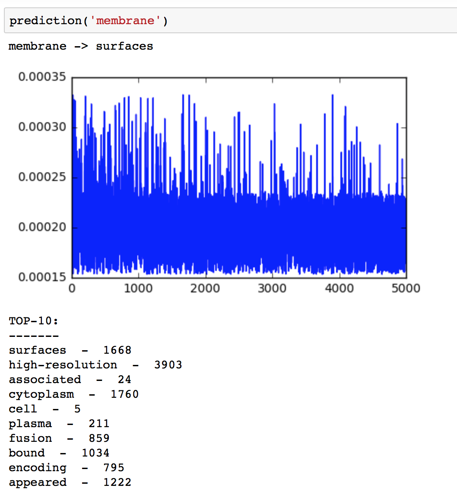
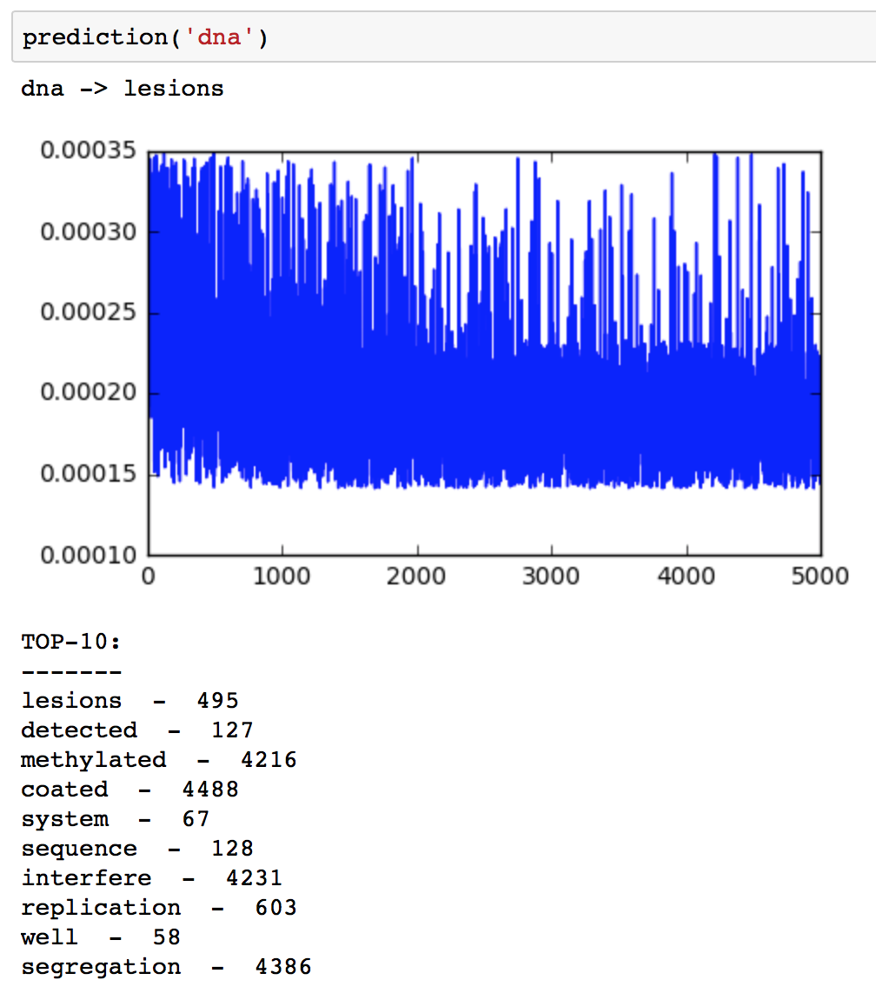
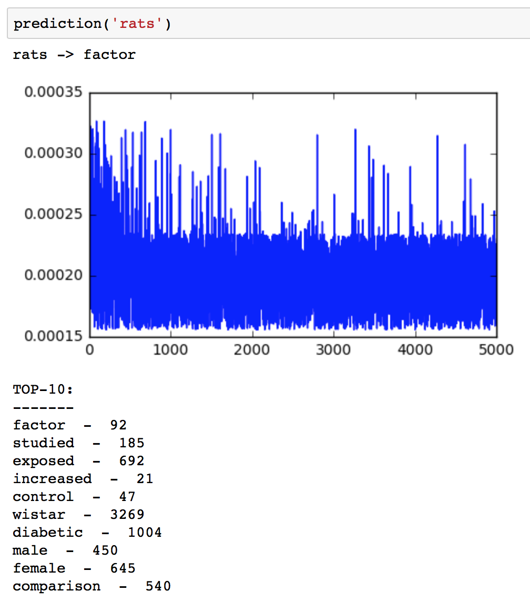
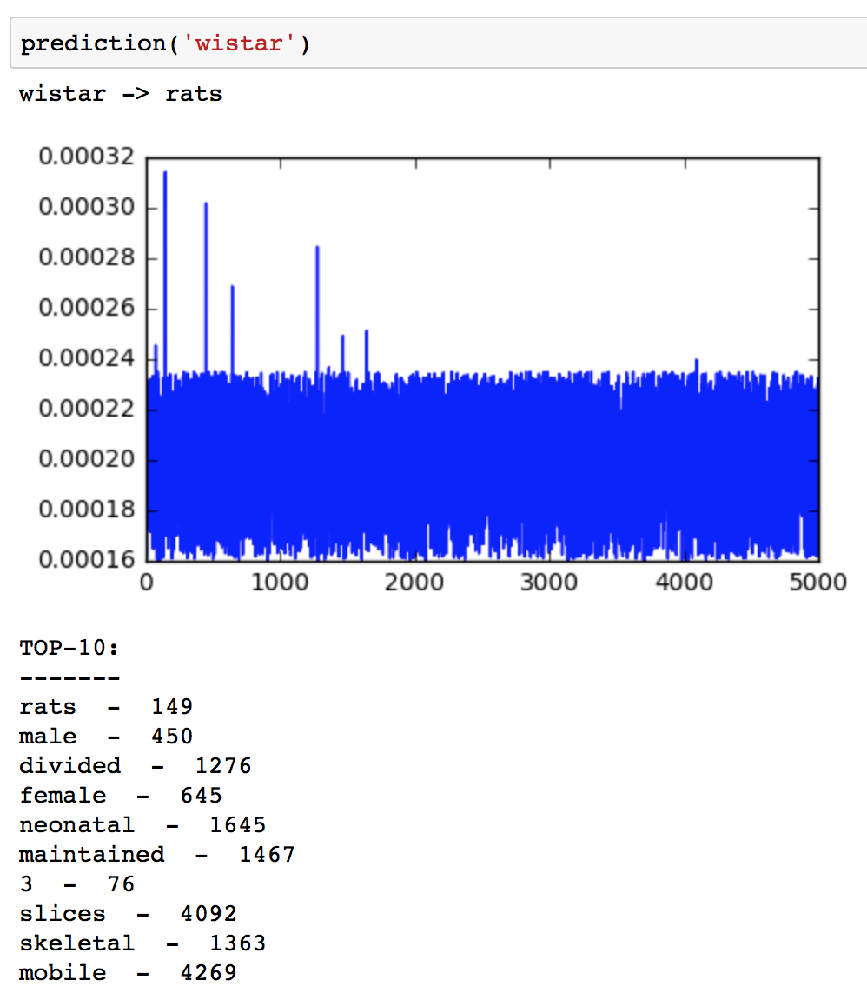
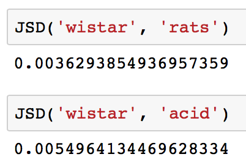
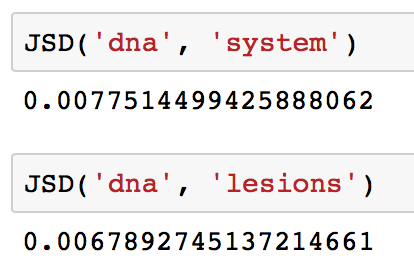
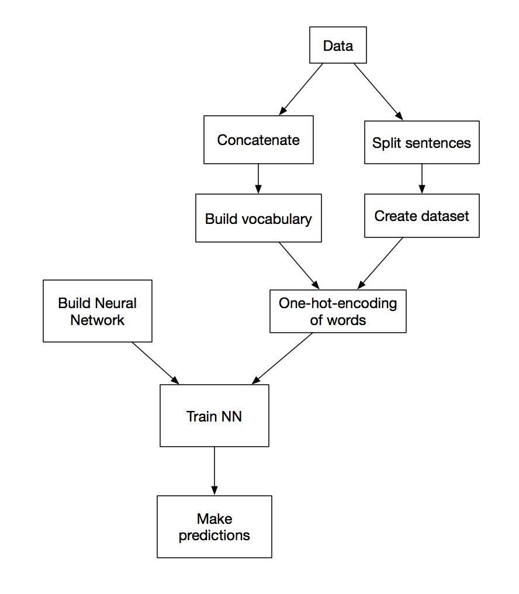

## Context prediction

Almost all function and methods are written in package `predictor.py`: [context_predictor/predictor.py](context_predictor/predictor.py).

| Probability [probably] distribution of | words in context     |
| :------------- | :------------- |
|   |     |
|  |  |

| Jensen-Shannon | Divergence   |
| :------------- | :------------- |
|       |   |

| Key points of my work  |
| :------------- |
|  |
